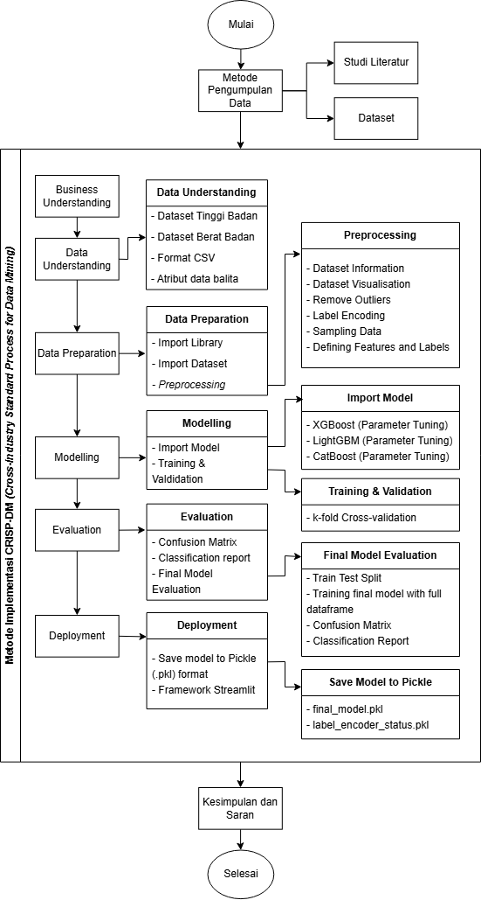

## Perbandingan Algoritma XGBoost, LightGBM dan CatBoost dalam Klasifikasi Status Gizi Balita Berdasarkan Standar Antropometri TB/U dan BB/U dengan Implementasi Web Streamlit
Repository ini berisi implementasi dan dokumentasi dari penelitian skripsi saya, penelitian ini bertujuan untuk membangun dan mengevaluasi model machine learning dalam melakukan klasifikasi status gizi balita, khususnya pada standar antropometri TB/U dan BB/U.

### Penelitian ini menggunakan metode CRISP-DM
Berikut adalah detail dari tahapan-tahapan CRISP-DM pada penelitian saya:


<p align="center">
  
</p>


### Cara Menjalankan Project
1. Clone Repo
      ```bash
   git clone https://github.com/hisbullah-ali/toddler-stunted.git
2. Install Dependencies
   ```bash
   pip install -r requirements.txt
4. Run
   ```bash
   streamlit run app.py

### Demo Aplikasi
Berikut adalah link web demo dari aplikasi klasifikasi status gizi balita:
[Klasifikasi Gizi Balita](https://klasifikasi-status-gizi-balita.streamlit.app/)
